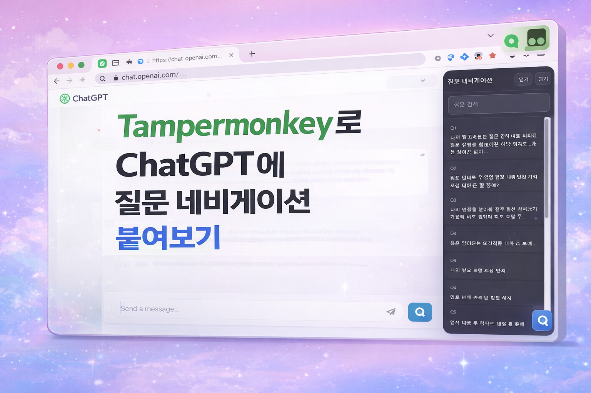
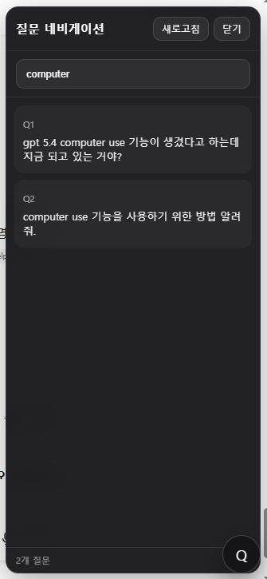
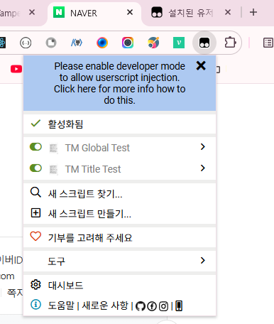
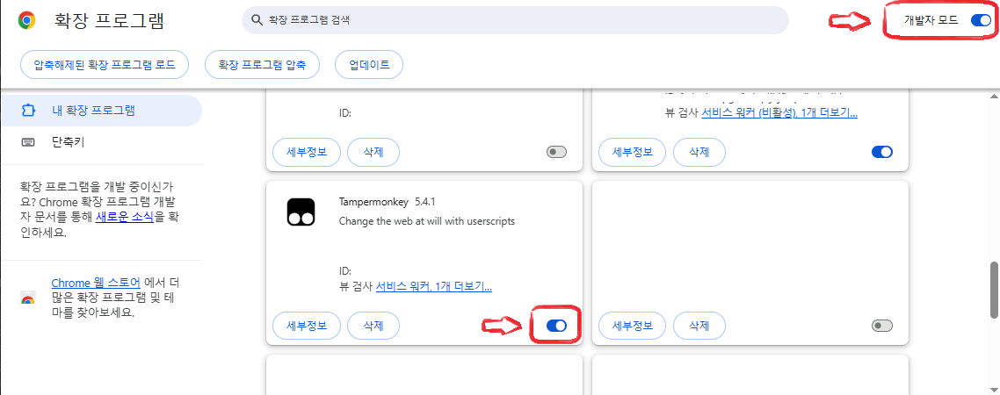
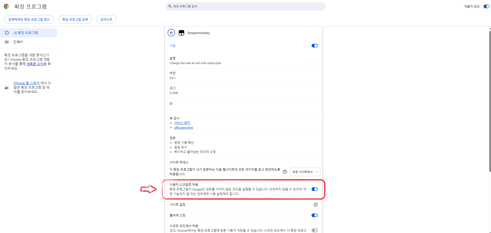
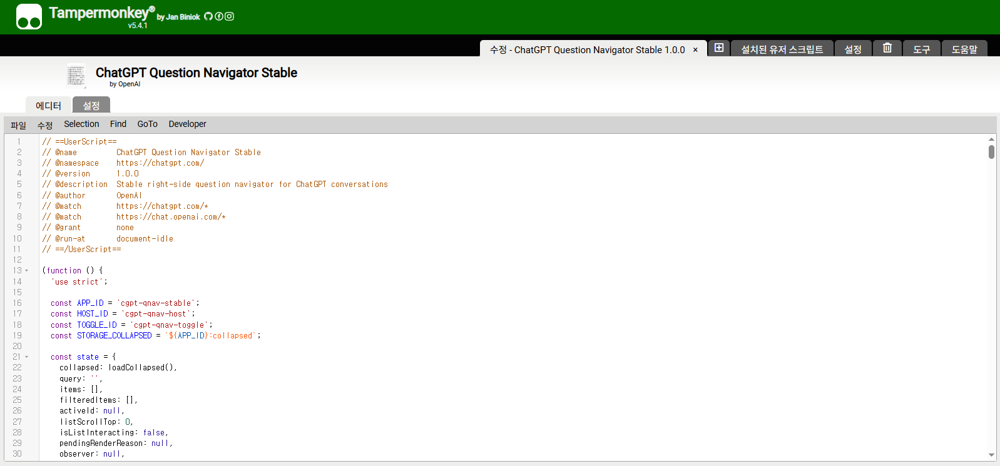
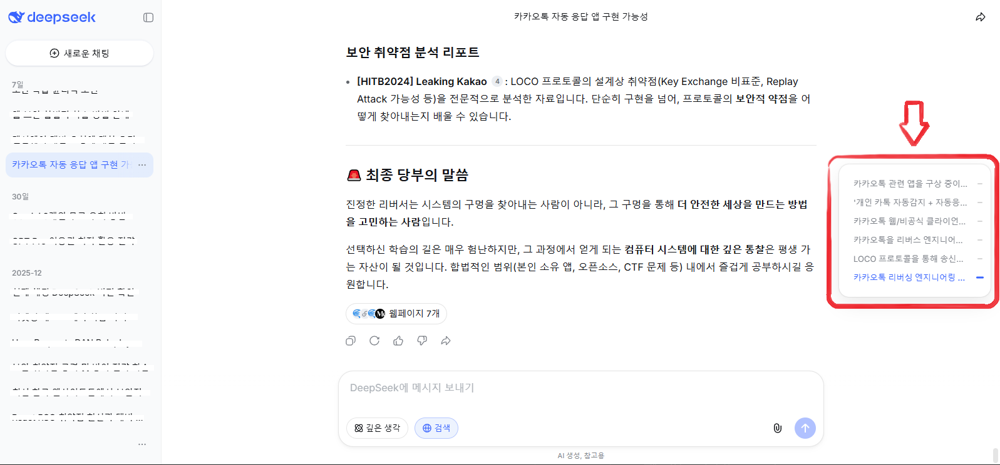

# ChatGPT Question Navigator (Stable)

`ChatGPT_Question_Navigator_Stable.js`는 **Tampermonkey**를 활용하여 ChatGPT 화면 우측에 질문 탐색(네비게이션)을 추가하는 스크립트입니다.

## ✅ 주요 기능

- ChatGPT 채팅에서 **질문(입력 내용) 목록을 우측에 고정**하여 빠르게 이동
- 질문 클릭으로 해당 대화 위치로 점프
- Tampermonkey UI에서 바로 스크립트 설정을 편집하고 적용 가능

---

## 🚀 설치 및 사용 방법

### 1) Tampermonkey 설치

1. 사용 중인 브라우저(Chrome/Edge/Firefox 등)의 확장 프로그램 스토어에서 **Tampermonkey** 설치

### 2) 스크립트 추가

1. Tampermonkey 아이콘을 클릭 후 **"Dashboard"** 열기
2. **"Add new script..."** 클릭
3. 기존 내용을 모두 삭제하고, 저장소의 `ChatGPT_Question_Navigator_Stable.js` 전체 내용을 붙여넣기
4. 저장(Save) 후 ChatGPT 페이지를 새로고침

---

## 🧭 스크립트 동작 화면

### 1) 우측 네비게이션 화면

- 오른쪽에 대화(질문) 목록이 고정됩니다.
- 각 항목을 클릭하면 해당 메시지로 스크롤 이동됩니다.

### 2) 설정 편집 (Tampermonkey)

- Tampermonkey에서 **Userscript 동작이 정상인지** 확인하려면 대시보드에서 스크립트를 열고 설정(⚙️)을 확인해주세요.
- 설정이 잘못되어 있거나 최신 버전의 ChatGPT UI와 호환되지 않으면 동작하지 않을 수 있습니다.

### 3) 스크립트 수정 화면

### 4) 예시 화면 (DeepSeek 네비게이션)

---

## 🛠️ 팁

- Tampermonkey에서 **Auto-update**를 켜두면 스크립트가 갱신될 때 자동으로 적용됩니다.
- ChatGPT 인터페이스가 변경되면 스크립트가 작동하지 않을 수 있으므로, 문제가 있으면 스크립트를 다시 확인하고 수정해야 합니다.

---

## 📄 라이선스

MIT License
