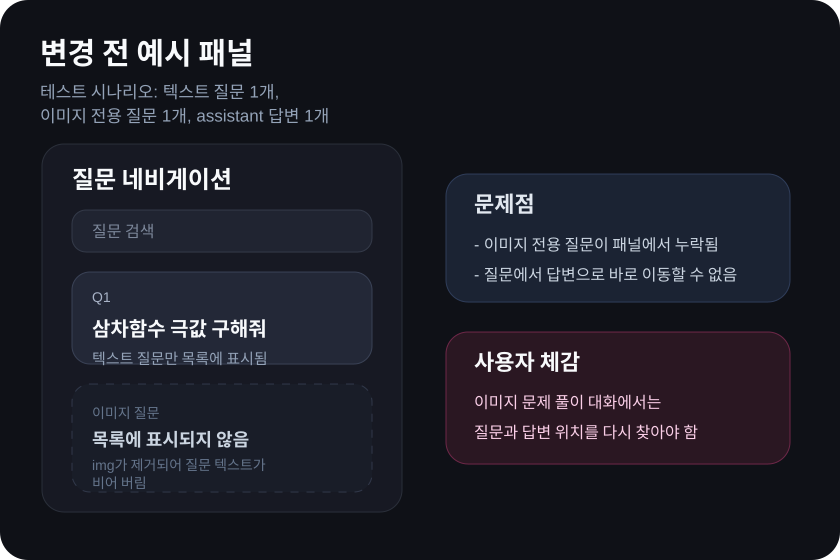
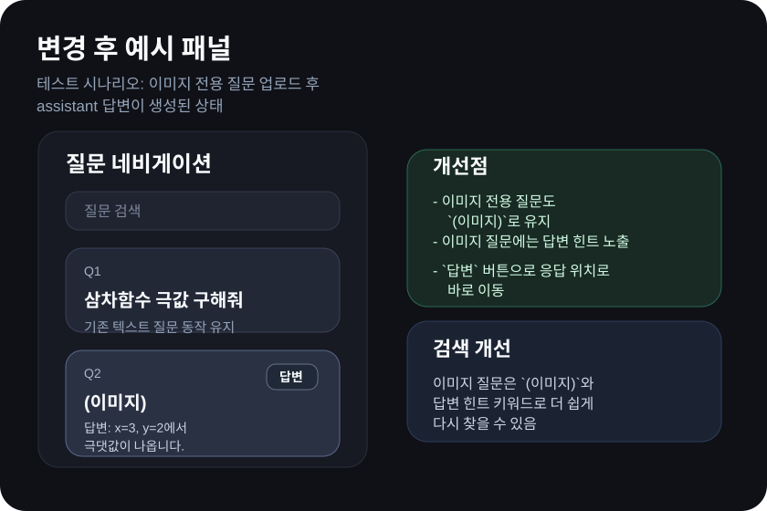

# ChatGPT Question Navigator (Stable)


`ChatGPT_Question_Navigator_Stable.js`는 **Tampermonkey**를 활용하여 ChatGPT 화면 우측에 질문 탐색(네비게이션)을 추가하는 스크립트입니다.

## ✅ 주요 기능

- ChatGPT 채팅에서 **질문(입력 내용) 목록을 우측에 고정**하여 빠르게 이동
- 질문 클릭으로 해당 대화 위치로 점프
- 이미지 전용 질문도 **`(이미지)` 표시와 함께 목록에 유지**
- 질문 카드에서 **`답변` 버튼으로 assistant 응답 위치로 바로 이동**
- 이미지 질문에 답변이 있으면 **첫 줄 기반 답변 힌트**를 함께 표시
- Tampermonkey UI에서 바로 스크립트 설정을 편집하고 적용 가능

---

## 🆕 최근 업데이트

- 이미지 업로드만 있는 질문도 네비게이션에 누락되지 않도록 수집 로직을 확장했습니다.
- 각 질문 항목에서 해당 assistant 답변으로 이동하는 `답변` 버튼을 추가했습니다.
- 이미지 질문에는 답변의 첫 줄을 추출한 참고용 힌트를 함께 표시합니다.
- 이미지 질문의 답변 힌트도 검색 인덱스에 포함되어 다시 찾기 쉬워졌습니다.

---

## 🚀 설치 및 사용 방법

### 1) Tampermonkey 설치

1. 사용 중인 브라우저(Chrome/Edge/Firefox 등)의 확장 프로그램 스토어에서 **Tampermonkey** 설치

### 2) 스크립트 추가

1. Tampermonkey 아이콘을 클릭 후 **"Dashboard"** 열기
2. **"Add new script..."** 클릭
3. 기존 내용을 모두 삭제하고, 저장소의 `ChatGPT_Question_Navigator_Stable.js` 전체 내용을 붙여넣기
4. 저장(Save) 후 ChatGPT 페이지를 새로고침

---

## 🧭 스크립트 동작 화면

### 1) 우측 네비게이션 화면


- 오른쪽에 대화(질문) 목록이 고정됩니다.
- 각 항목을 클릭하면 해당 메시지로 스크롤 이동됩니다.

### 1-1) 최근 변경 테스트 예시 (변경 전/후)

- 테스트 기준: 이미지 전용 질문 업로드 후 assistant 답변이 생성된 대화
- 아래 예시는 최근 업데이트가 패널에 어떻게 반영되는지 보여주는 문서용 예시 이미지입니다.

| 변경 전 | 변경 후 |
| --- | --- |
|  |  |

- 변경 전: 이미지 전용 질문은 목록에서 빠지고, 질문에서 답변으로 바로 이동할 수 없습니다.
- 변경 후: 이미지 전용 질문이 `(이미지)`로 남고, `답변` 버튼과 답변 힌트가 함께 표시됩니다.

### 2) 설정 편집 (Tampermonkey)

- Tampermonkey에서 **Userscript 동작이 정상인지** 확인하려면 대시보드에서 스크립트를 열고 설정(⚙️)을 확인해주세요.
- 설정이 잘못되어 있거나 최신 버전의 ChatGPT UI와 호환되지 않으면 동작하지 않을 수 있습니다.


### 3) 스크립트 수정 화면


### 4) 예시 화면 (DeepSeek 네비게이션)


---

## 🛠️ 팁

- Tampermonkey에서 **Auto-update**를 켜두면 스크립트가 갱신될 때 자동으로 적용됩니다.
- ChatGPT 인터페이스가 변경되면 스크립트가 작동하지 않을 수 있으므로, 문제가 있으면 스크립트를 다시 확인하고 수정해야 합니다.

---

## 🧪 개발 워크플로

- 실제 수정 대상 소스는 `src/` 디렉터리입니다.
- 배포용 userscript 파일인 `ChatGPT_Question_Navigator_Stable.js`는 생성 파일이므로 직접 수정하지 않습니다.
- 소스를 수정한 뒤 아래 명령으로 userscript를 다시 생성합니다.

```bash
npm run build
```

- PowerShell 실행 정책 때문에 `npm run build`가 막히는 환경에서는 아래 명령을 사용합니다.

```bash
node scripts/build-userscript.mjs
```

- 병렬 작업 시에는 각 lane이 자신의 `src/*.js` 파일만 수정하고, 루트 userscript와 `README.md`, `package.json`, `scripts/build-userscript.mjs`는 순차적으로만 갱신하는 것을 권장합니다.

---

## 📄 라이선스

MIT License
